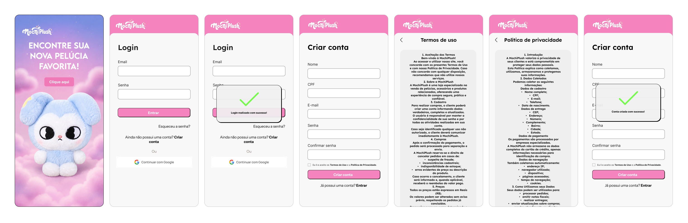
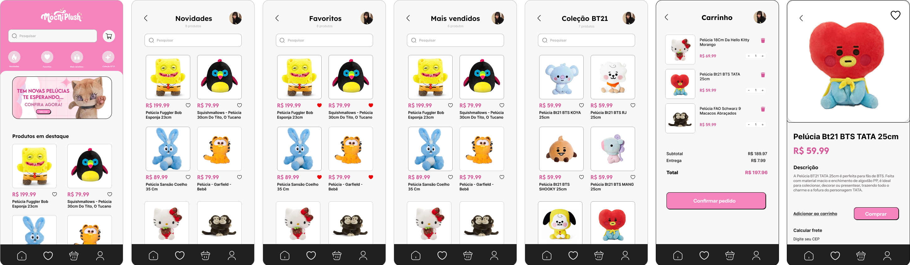
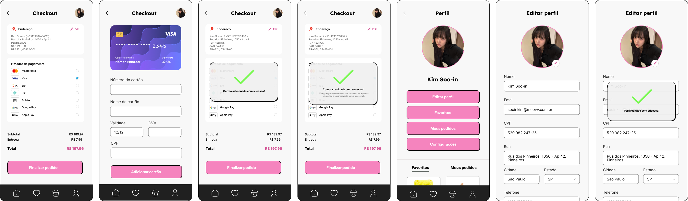
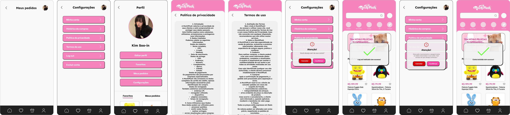

# 🧸🌸 mochiplush frontend 💗

frontend de uma loja fictícia de pelúcias colecionáveis criada para proporcionar uma experiência de compra moderna, intuitiva e encantadora. a interface foi construída com foco em ui/ux, responsividade e componentização utilizando react.

---

# 💗 hospedagem e acesso

o projeto ainda não possui hospedagem, pois está em desenvolvimento. a versão atual contempla apenas o frontend, enquanto o backend será implementado futuramente.

**🎥 vídeo demonstrativo:** *[(confira aqui!)](https://youtu.be/pskhIMdbCp0?si=P6T6HP9BCoFgjvyl)*

---

# 🧸 preview do projeto

a seguir estão algumas telas da interface da mochiplush.

## 🌸 autenticação

<p align="center">
  
</p>

## 🛍️ catálogo e produtos

<p align="center">
  
</p>

## 👤 perfil, configurações, carrinho e checkout

<p align="center">
  
</p>

## 💖 pedidos, políticas e modais

<p align="center">
  
</p>

---

# 💗 visual & experiência

a mochiplush foi inspirada em lojas modernas de produtos colecionáveis, utilizando uma identidade visual delicada, cores suaves e elementos minimalistas para proporcionar uma navegação agradável.

### 🌸 destaques

- 💗 interface clean e moderna
- 🧸 identidade visual inspirada em pelúcias colecionáveis
- 🎀 paleta em tons de rosa, branco e preto
- ✨ componentização utilizando react
- 📱 layout totalmente responsivo
- 💖 feedback visual através de modais
- 🛒 fluxo completo de compra

---

# 🌸 tecnologias utilizadas

- ⚛️ react
- ⚡ vite
- 🎨 tailwind css
- 📝 html
- 💅 css
- 🎯 javascript (es6+)
- 🎨 figma

---

# 🛍️ funcionalidades

| funcionalidade | descrição |
|----------------|-----------|
| 🏠 home | página inicial com categorias, coleções e produtos em destaque. |
| 🔍 pesquisa | busca de produtos pelo catálogo. |
| ❤️ favoritos | adicionar e remover produtos favoritos. |
| 🧸 coleções | navegação entre coleções exclusivas. |
| 🛍️ novidades | página com os lançamentos da loja. |
| ⭐ mais vendidos | exibição dos produtos mais populares. |
| 📦 produto | visualização detalhada do produto. |
| 🛒 carrinho | adicionar, remover e alterar a quantidade dos produtos. |
| 💳 checkout | seleção de endereço, forma de pagamento e finalização da compra. |
| 👤 perfil | visualização dos dados do usuário. |
| ✏️ editar perfil | atualização das informações pessoais. |
| 📦 meus pedidos | histórico de compras realizadas. |
| ⚙️ configurações | gerenciamento da conta. |
| 🔐 login | autenticação do usuário. |
| 📝 cadastro | criação de uma nova conta. |
| 📜 termos de uso | página institucional. |
| 🔒 política de privacidade | página institucional. |
| 🚪 logout | encerramento da sessão. |
| ❌ excluir conta | exclusão permanente da conta. |
| 💖 modais | mensagens de confirmação, sucesso e alerta durante as ações do usuário. |

---

# 🌸 estrutura do projeto

```text
src
│
├── assets
│   ├── components
│   │   ├── AddressCard
│   │   ├── CartItem
│   │   ├── CategoryButton
│   │   ├── CategoryList
│   │   ├── Header
│   │   ├── HeaderHome
│   │   ├── Menu
│   │   ├── Modal
│   │   ├── PaymentMethod
│   │   ├── ProductCard
│   │   ├── ProductHeader
│   │   ├── ProductNews
│   │   ├── ProductSection
│   │   └── SearchBar
│   │
│   └── img
│       └── ReadMe
│           ├── pt1.png
│           ├── pt2.png
│           ├── pt3.png
│           └── pt4.png
│
├── pages
│   ├── BestSellers
│   ├── Cart
│   ├── Checkout
│   ├── CheckoutCard
│   ├── CollectionBT21
│   ├── EditProfile
│   ├── Favorites
│   ├── Home
│   ├── Login
│   ├── MyOrders
│   ├── News
│   ├── PrivacyPolicy
│   ├── ProductPage
│   ├── Profile
│   ├── Register
│   ├── Settings
│   ├── TermsOfUse
│   └── Welcome
│
├── App.css
├── App.jsx
├── index.css
└── main.jsx
```

---

# 💗 instalação local

### 🌸 1. clonar o repositório

```bash
git clone https://github.com/scriptlver/mochiplush-frontend.git

cd mochiplush-frontend
```

### 🌸 2. instalar as dependências

```bash
npm install
```

### 🌸 3. executar o projeto

```bash
npm run dev
```

---

# ✨ design

todo o projeto foi planejado previamente no figma, buscando manter fidelidade entre o protótipo e a implementação final.

durante o desenvolvimento foram aplicados princípios de ui/ux como:

- 💗 hierarquia visual
- 🧸 componentização
- ✨ consistência entre telas
- 📱 responsividade
- 🎀 feedback visual ao usuário
- 🛍️ fluxo intuitivo de navegação

---

# 💖 responsividade

a interface foi desenvolvida pensando principalmente na experiência mobile, mantendo a consistência visual e funcionalidade em diferentes resoluções de tela.

---

# 🌸 observações finais

💗 projeto desenvolvido para fins acadêmicos e composição de portfólio.

🧸 a mochiplush é uma loja fictícia criada para demonstrar conhecimentos em desenvolvimento front-end, componentização, ui/ux e design responsivo.

🎨 toda a identidade visual, prototipação e interface foram elaboradas no figma antes da implementação.

✨ o projeto reúne conceitos de organização de componentes, experiência do usuário e desenvolvimento de interfaces modernas utilizando react e tailwind css.
